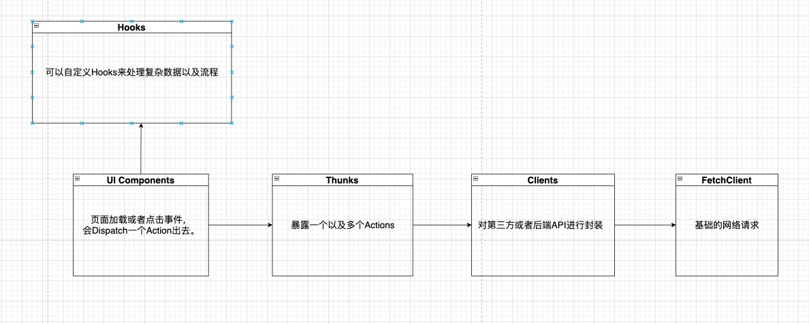

# POS(RN) 代码开发规范
规范只是为了统一公司项目的代码风格，代码实现方式千千万万，为了提高公司项目的可维护性和持续开发性，请大家遵守统一的代码规范(如有觉得不合理的地方可以提出意见，<font color="red">并提供具有说服力的理由</font>)。自己独有的代码风格，请到自己的私有repo践行。
****

- [命名](#命名)
- [模块](#模块化)

## 命名

- [文件名](#文件名)
- [文件夹名字](#文件夹名字)
- [布尔类型](#布尔类型)
- [事件处理](#事件处理)
- [异步处理](#异步处理)
- [路由跳转](#路由跳转)
- [单一职责](#单一职责)

### 文件名
对于Class或者React Native本身渲染组件，要求首字母大写。对于其他的工具类，我们要求采用camelCase.

### 文件夹名字
我们不采用拍平方式来区分各自的组件，我们需要用文件夹来区分各自的业务代码或者共享组件。比如

``````
-- presentation
    -- como
        -- GiftList.tsx
-- infrastructure
    -- clients
        -- como
            -- ComoClient.ts
            -- Purchase.ts
``````

### 布尔类型

##### 表示可见性，进行中的状态:
***

推荐使用<font color="red"> is + 动词(现在进行时)/形容词</font> 方式来定义。


#### 属性状态类
****

参照各种原生组件，比如<font color="red">disabled, editable, readonly</font>

#### 配置类选项
****

<font color="red">allowXXX, enableXXXX</font>

### 事件处理
****

对于事件处理，统一使用<font color="red">handleXXX</font>规范来处理事件函数。

###  异步处理
****

<font color="red">getXXX</font>: 获取数据(包含从API获取原始数据，也可以是加工的数据)

<font color="red">deleteXXX</font>: 删除数据

<font color="red">removeXXX</font>: 语义上是移除数据，通常数据还是存在，没有显示。

<font color="red">updateXXX</font>: 更新操作。

<font color="red">addXXX</font>: 添加新的子项

<font color="red">createXXX</font>: 创建实例

### 路由跳转
****
当前页面或者非当前页面跳转，使用<font color="red">toXXX</font>

### 单一职责
****
所有的方法命名必须遵循单一职责原则。


## 模块化

- [Presentation](#Presentation)
- [Infrastructure](#Infrastructure)

### Presentation
 - [Hooks](#Hooks)
 - [类型](#类型)
 - [组件抽象](#组件抽象)
 - [优化](#优化)

#### Hooks
****
公共类Hook放在Hooks的文件夹下面，如果不是该Hooks不具有复用性，请与业务组件平级。

#### 类型
****
现在项目React版本已经<font color="red">18</font>了, 为了更好的拥抱hooks，UI层展示类组件，请使用<font color="red">函数式</font>组件。

#### 组件抽象
****

1. 为了不让一个组件的代码长度爆炸，请对组件进行对应的抽象，拆成多个文件，拆组件请遵守<font color="red">SOLID</font>原则。

2. 针对基础类组件（DatePicker, Input, etc...), 请考虑对组件进行基础封装，基础组件不能涉及任何业务相关代码。

#### 优化
***
针对函数式的组件里面的变量以及函数的定义，请考虑使<font color="red">useCallback，useMemo</font>包裹。

针对组件，请考虑使用<font color="red">React.memo</font>进行包裹。

请注意自己Hooks的<font color="red">dependency</font>的定义是否正确，以及<font color="red">闭包</font>可能带来的问题。

### Infrastructure
***

下图是现在RN项目的请求一个API流程。



- [Thunks](#Thunks)
- [Clients](#Clients)
- [Services](#Services)
- [StateManagement](#StateManagement)
- [Factory](#Factory)
- [Repository](#Repository)

#### Thunks
我们采用Thunks处理异步请求,下面是Thunks的一些职责。
***
 - 集成Client的API。
 - 针对ClientsAPI的变种，根据实际业务需求变种。
 - 构建一些请求体（构建方法请与Thunk解耦）
 - 派发需要的Actions

#### Clients
*** 
针对第三方API(AWS S3, Como, etc...)或者后端API的集成。

#### Services TODO
***

#### StateManagement
***
项目集成了<font color="red">Redux-toolkit</font>以及<font 
color="red">Redux-persist</font>进行数据管理以及持久化数据。Redux的Init需要建立对应的Slice来处理，不需要额外的Action以及Reducer文件。

此外对State的查询，需要建立对应的文件放在selectors下面，方便统一管理。可以通过<font color="red">CreateSelector</font>对查询进行优化。

#### Factory (TODO)
***

#### Repository (TODO)
***